# Procesverslag

## Jij

### Ontwerper:
Maxime

#### Je startniveau:
Blauw

# Je plan
§

  
De eerste versie/schets van je ontwerp & je persoonlijke uitdaging

### Waarom peach?
bekendste vrouwelijke game character,
ze is van de vrouwelijke personage die bang is en altijd in nood is gegaan naar een strijdlustige en niet bange personage,
is een vrouwelijke character die stoer en independent is dit komt niet vaak voor,
ze is één van de weinige vrouwelijke speelbare karakters,
het is leuk om te zien hoe ze in de loop van de jaren is veranderd qua design,
ik vind de spellen van mario heel leuk en ik was benieuwd naar de achtergrond en de verandering van peach.

  ### De eerste versie/schets:
 
 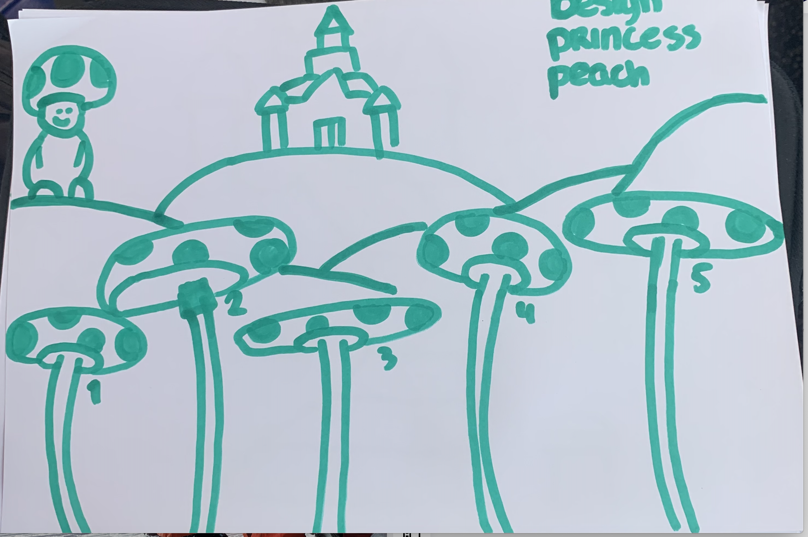
 
 
 
 
 
 
 

  ### Je ambitie: 
  Aan deze technieken/punten wil ik werken:
  - positioneren van items op de pagina
  - netjes werken
  - research doen naar bepaalde code op internet
 

## Voortgang/Feedback 1

  details
  Feedbackpunten:
  -Ik vind dit een goed idee en een leuke vormgeving, wel kunnen de paddenstoelen ook bij bijvoorbeeld het onderwerp 'Mario' passen. Wellicht kan je nog iets extra's toevoege dat echt alleen bij Princess Pech hoort.

  Het einde waarbij Peach met Mario eindigt is erg sterk!
  - probeer de eilandjes misschien wat kleiner te maken
  - je zou de eilandjes in de stijl van de peach kunnen doen

  
Mijn bevindingen + wijzigingen (minimaal 5)

  - Ik ga mijn paddenstoelen veranderen naar eilandjes omdat dit beter past bij peach.
  - ik hou eerst mijn eilandjes zoals nu met gras maar als ik later tijd heb ga ik ze veranderen naar eilandjes met ijs of zand van de werelden van mario bros.
  - als ik tijd heb lijkt mij het ook een leuk idee om de eilandjes te ontwerpen in de stijl van de peach van dat tijdperk
  - ik ga het logo/de titel in de zelfde stijl doen als de titel van het spel Super Princess Peach.
  - elementen die ik toevoeg hoe ik in de stijl van de eilandjes
  - de eilandjes maak ik iets kleiner en beter op schaal

  ### Bevinding 1:
 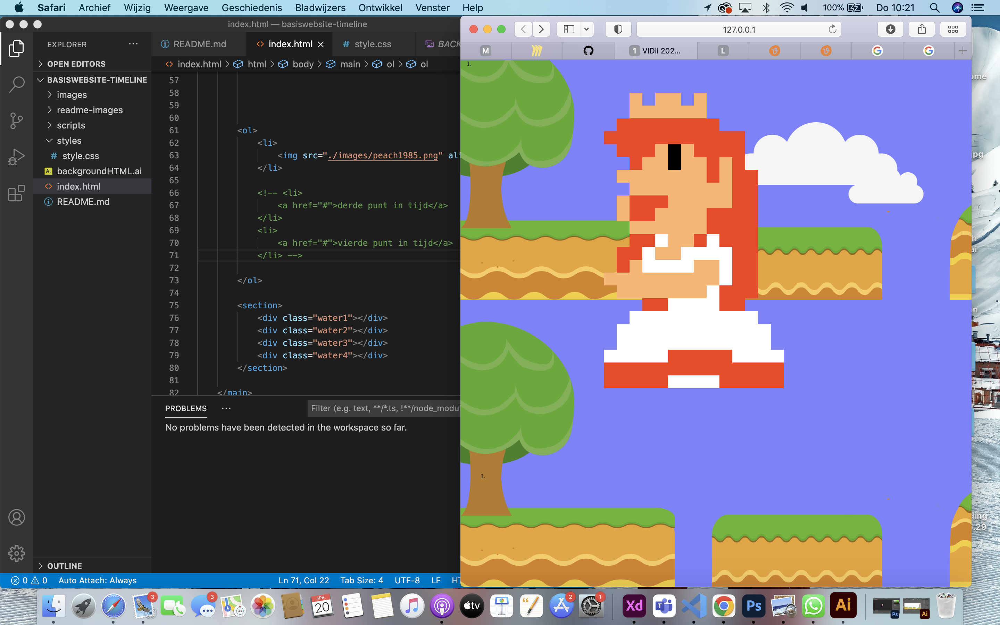
  De background images stond niet goed. De achtergrond was te klein/paste niet en verdubbelde zich.

  #### oplossing:
  Beschrijving hoe je het hebt hebt opgelost of als het niet gelukt is hoe je het zou oplossen (tekst en afbeeding(en)).

  Ik heb dit probleem opgelost dmv deze code:
  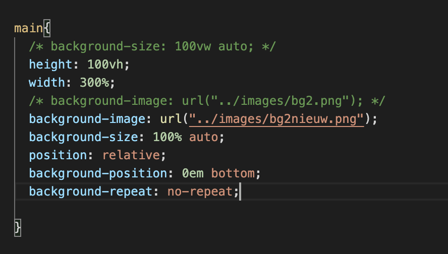

  ### Bevinding 2:
  Ik wilde de titel namaken van het spel Super Princess Peach. Dit lukte niet heel erg goed.
  
  

  #### oplossing:
  Zoals je kan zien heb ik de titel uiteindelijk anders gemaakt.het lukte mij niet om een achtergrond kleur achter en rond om de letters temaken. ik heb dit na proberen te maken dmv deze code:
  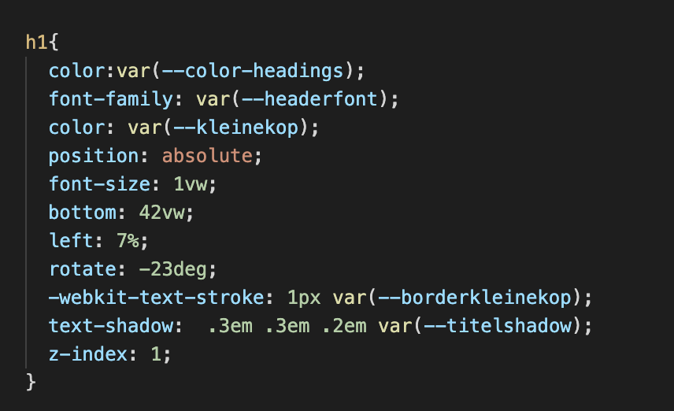

  ### Bevinding 3:
Ik wilde zorgen dat het duidelijk was dat de peaches klikbaar waren. Dit wilde ik doen met een witte glow die aan en uit gaat. ik dacht dat je de peach dan gewoon een shadow kon geven maar dit werkte niet.
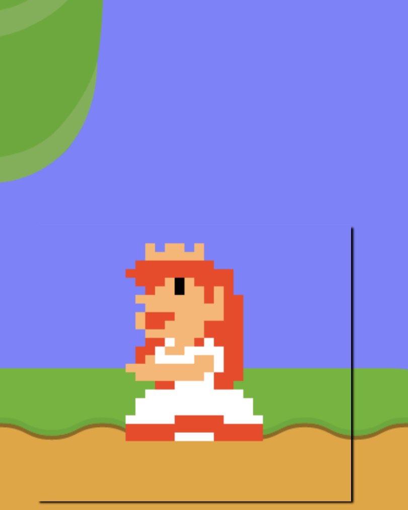

#### oplossing:
Ik heb dit probleem opgelost door ipv box-shadow of border te  gebruiken filter te gebruiken. Hierdoor gaf die de kleur alleen mee op plekken het figuur zich bevindt waardoor er precies een mooie witte kleur om de peach komt.

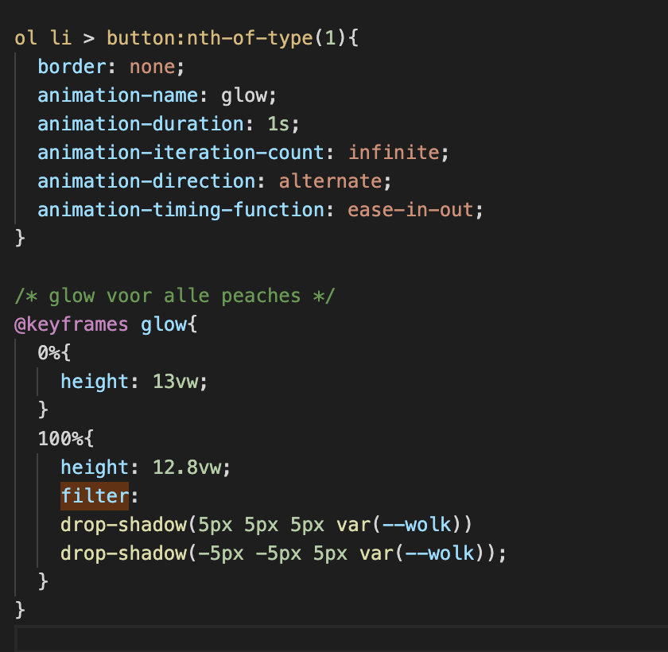

## Voortgang/Feedback 2

  
Ik heb geleerd om een wolk te maken en te laten bewegen daarbij heb ik geleerd om mijn achtergrond er te zetten en het mogelijk te maken om horizontaal te scrollen. 
  

  
  ### Bevinding 1:
  Ik had op het begin geen idee hoe ik er voor moest zorgen dat ik horizontaal door mijn achtergrond kon scrollen. Eerst zag het er zo uit en kon je niet scorllen:
  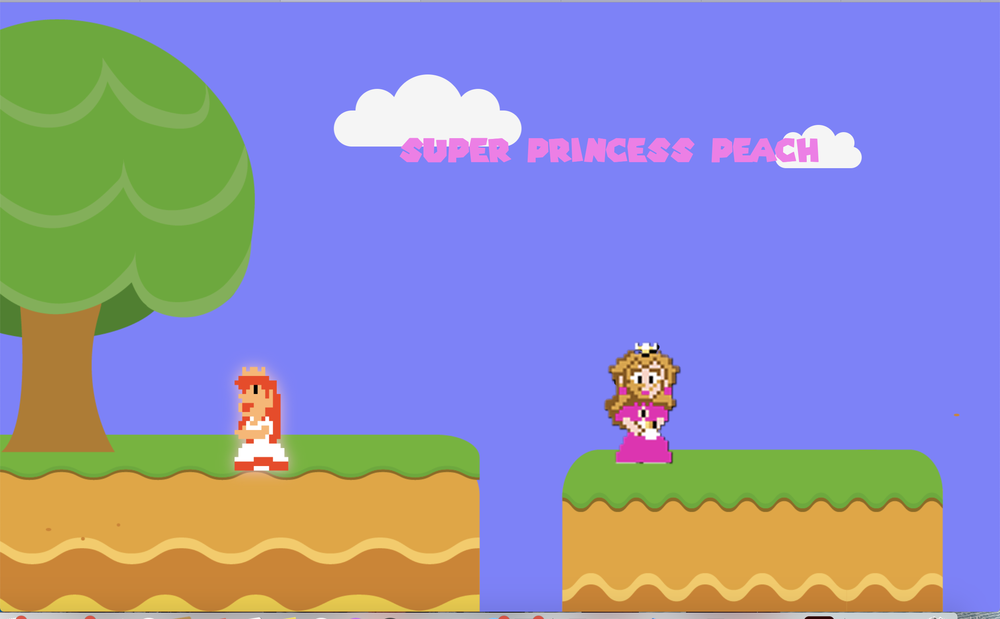

  #### oplossing:
  Hieronder is de code te zien waardoor het uiteindelijk wel lukte:
  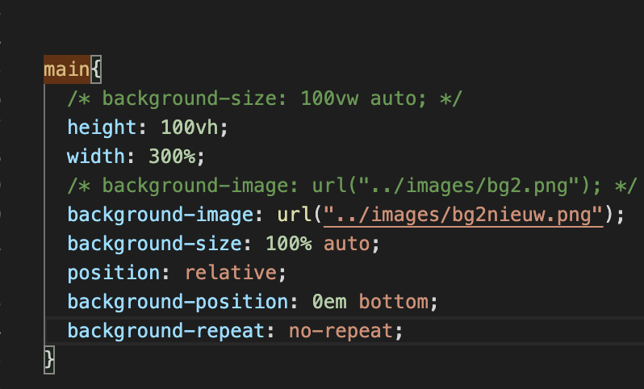

  ### Bevinding 2:
  Ik wilde een afbeelding van de stukjes land dat ik op adobe illustrator heb gemaakt op mijn pagina zetten. Ik dacht eerst dat ik dit er gewoon in kon zetten als normale img. Maar dit werkte niet. 

  #### oplossing:
  Hieronder is de code te zien waarmee ik het uiteindelijk heb gedaan. Wat belangrijk was was dat ik de afbeelding in de main zette en niet in de body zodat ik er dan voor kan zorgen dat ik de width op meer dan 100% kon zetten waardoor ik er door heen kon scrollen. 
  

## Voortgang/Feedback 3

  
 Ik heb uitleg gekregen hoe ik een smiley maak en heb ik mijn eerste paars peach's geplaatst en gepositioneerd in mijn website.

 

  ### Bevinding 1:
  De smiley vond ik heel moeilijk om te maken en het lukte mij niet om via internet het te maken, daarom ben ik naar Sanne gegaan en heb ik hem om hulp gevraagd. Hier zie je het eindresultaat:
  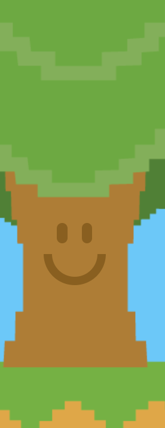

  #### oplossing:
  Uiteindelijk hebben we samen een code gemaakt en heb ik daarna de code proberen na te maken voor mijn eigen website. Dit was de code:
  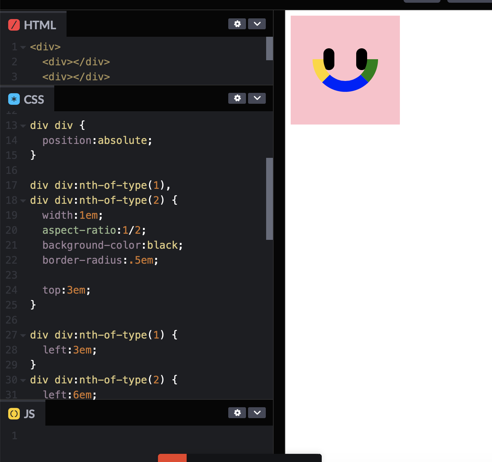

  ### Bevinding 2:
  Ik wilde op elk stukje land een peach, maar de vraag was; hoe ga ik deze positioneren.
  Ik wilde ze allemaal op een andere plek en hoogte en ik wilde dat ze op de juiste plek bleven als ik het scherm kleiner of groter maakte. 
  
  
  #### oplossing:
  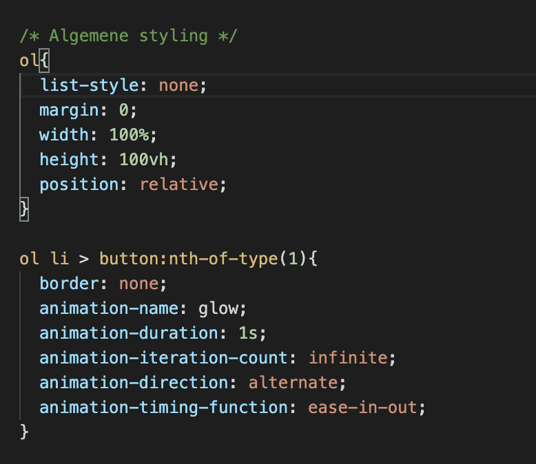
  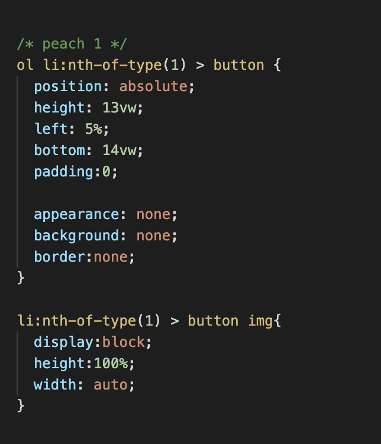
  De parent is de ol en die geef je position:relative mee en de kinderen, alle li's geef je dan een postion: absolute. Dan kan vervolgens de posities worden bepaald met bottom en left.
 

## Reflectie

  
Mijn eindresultaat & persoonlijke ontwikkeling

  ### Je uitkomst - karakteristiek screenshot(s):
  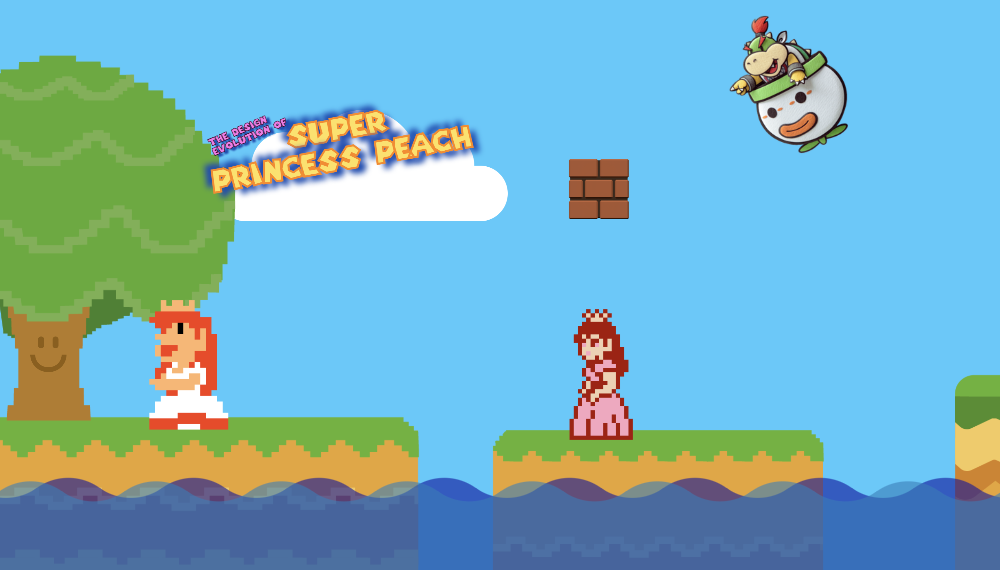
§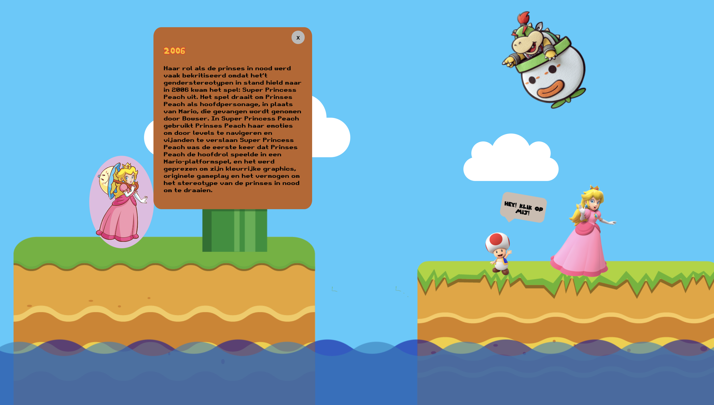
§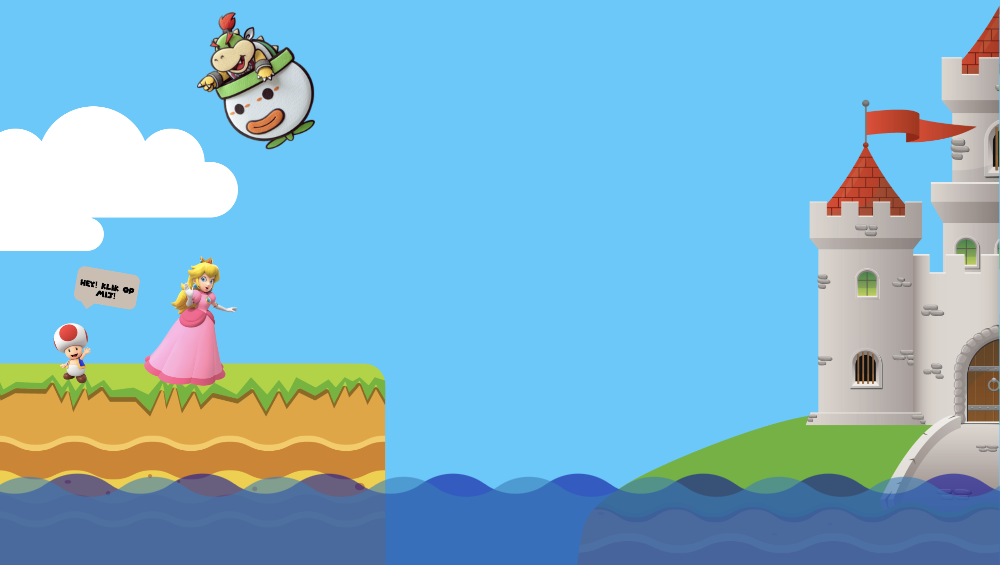

  ### Dit ging goed/Heb ik geleerd: 
  Wat goed ging was het positioneren van de peaches, het maken van de html en het importeren van nieuwe fonts. 

  ### Dit was lastig/Is niet gelukt:
  Wat minder goed ging was het positioneren van de background image en en het responsive maken van de items op de pagina. Ook had ik tijdens het maken van de html soms content verkeerd genoemd. een div moest vaak een section zijn of andersom. Als laatste merkte ik dat het netjes werken vaak nog steeds niet helemaal goed ging. Wat ik wel merkte is dat ik vooral slodderiger werd wanneer ik te lang achter elkaar aan het werk was. Voor de volgende keer is het soms goed om wat vaker korte pauzetjes te doen om scherper te blijven.

## Bronnenlijst

continu bijhouden terwijl je werkt

1. https://www.google.com/url?sa=i&url=https%3A%2F%2Fwww.mariowiki.com%2FPrincess_Peach&psig=AOvVaw3gleafAFIgVZvQZfaiPX0E&ust=1682418420695000&source=images&cd=vfe&ved=0CBMQjhxqFwoTCNjs4ZSnwv4CFQAAAAAdAAAAABAE
2. https://en.wikipedia.org/wiki/Super_Princess_Peach
3. https://www.google.com/url?sa=i&url=https%3A%2F%2Fmario.fandom.com%2Fnl%2Fwiki%2FMunt&psig=AOvVaw0WatKZ3lebEG27eb-po6xS&ust=1682429345256000&source=images&cd=vfe&ved=0CBMQjhxqFwoTCLi-5O3Pwv4CFQAAAAAdAAAAABAJ 
4. https://css-generators.com/wavy-shapes/ 
5. https://www.google.com/url?sa=i&url=https%3A%2F%2Fpapermario.fandom.com%2Fwiki%2FPrincess_Peach&psig=AOvVaw2EmjxVCeIgvFZ2I73NREKr&ust=1682417815254000&source=images&cd=vfe&ved=0CBMQjhxqFwoTCLjY__Okwv4CFQAAAAAdAAAAABAE
6. https://www.google.com/url?sa=i&url=https%3A%2F%2Fwww.pngegg.com%2Fen%2Fsearch%3Fq%3Dprincess%2BPeach&psig=AOvVaw2lEIKHavRGHsWCfcQ51vJ7&ust=1682418790724000&source=images&cd=vfe&ved=0CBMQjhxqFwoTCLDmg8Wowv4CFQAAAAAdAAAAABAE
7. https://www.npr.org/2023/04/11/1169318335/princess-peach-takes-the-lead-in-new-super-mario-movie
8. https://mario-bros.fandom.com/nl/wiki/Super_Mario_Bros._2
9. https://www.thegamer.com/super-mario-every-game-play-princess-peach/
10. https://nl.wikipedia.org/wiki/Princess_Peach
11. https://mario-bros.fandom.com/nl/wiki/Princess_Peach
12. https://themushroomkingdom.net/media/smb/wav (audio)
13. https://nl.pinterest.com/pin/78179743505615681/

Notities en informatie: https://miro.com/app/board/uXjVMeVSbWg=/?moveToWidget=3458764551839301019&cot=14

